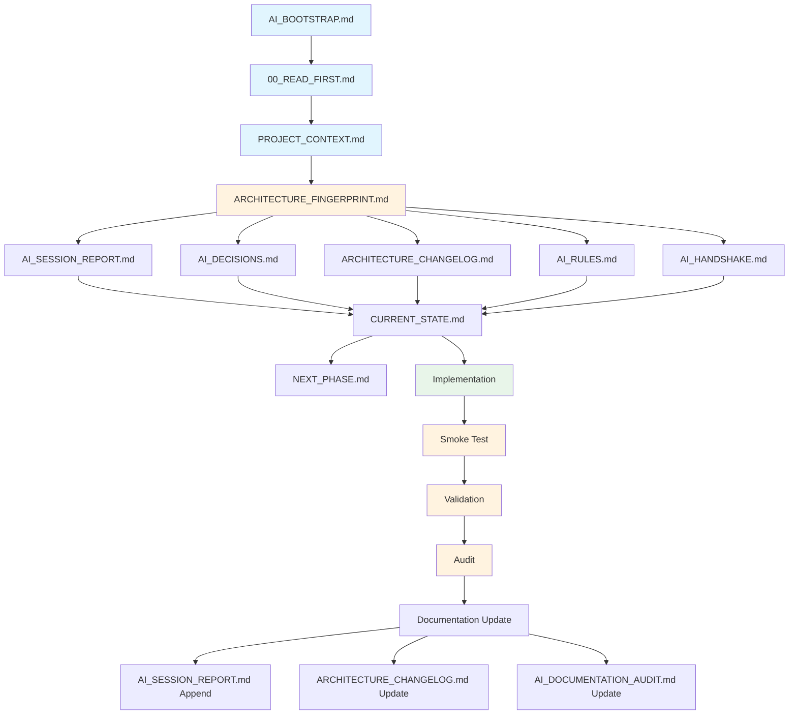

# AI Documentation Flow

## Legend

- **Blue**: Entry documents (mandatory reading)
- **Orange**: Core architecture documents
- **Green**: Implementation phase
- **Yellow**: Validation phase

## Flow Description

1. Every AI session starts at **AI_BOOTSTRAP.md**
2. Follow reading order through **00_READ_FIRST.md**
3. Build context via **PROJECT_CONTEXT.md** and **ARCHITECTURE_FINGERPRINT.md**
4. Verify via **AI_HANDSHAKE.md** checklist
5. Implement
6. Run **Smoke Test**
7. Validate
8. Audit
9. Update documentation
