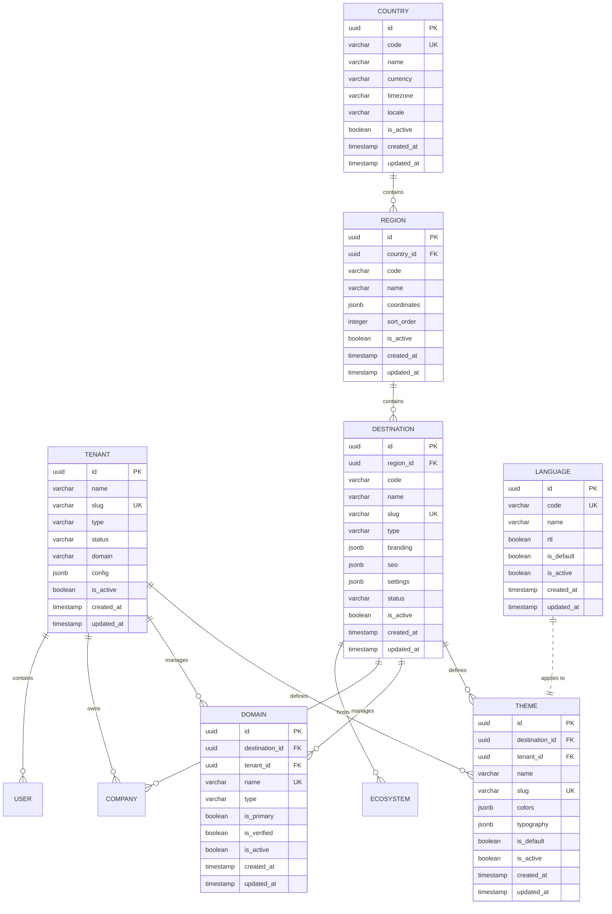
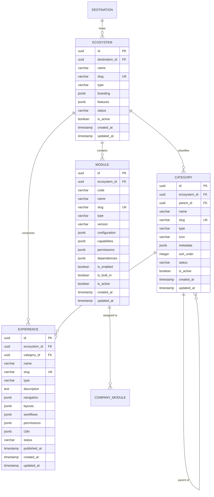
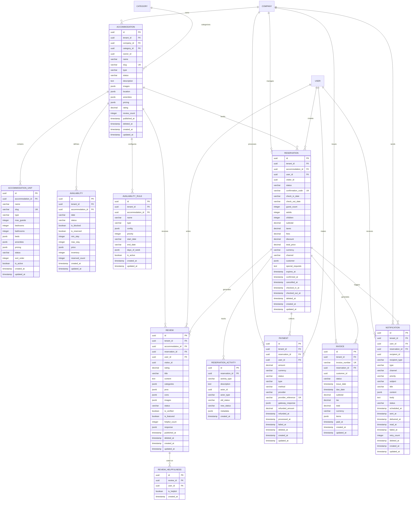
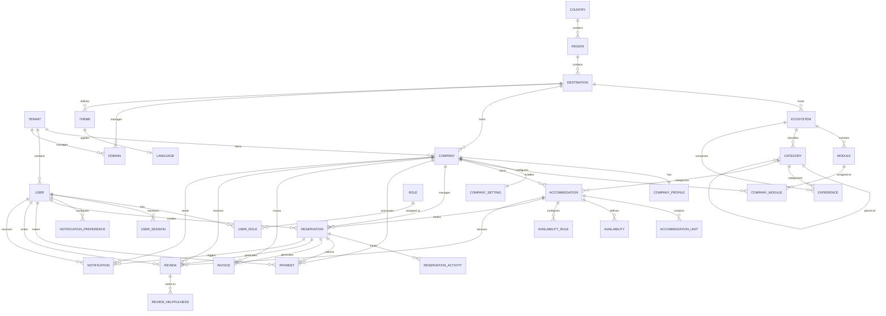
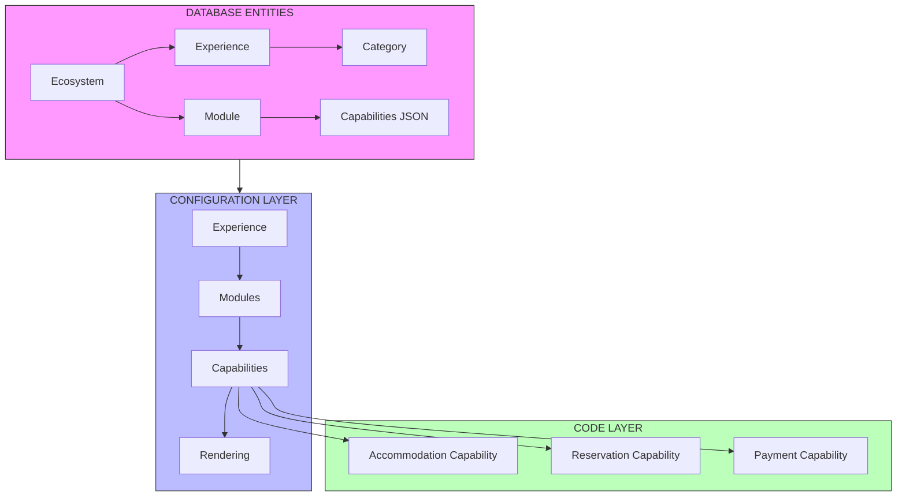
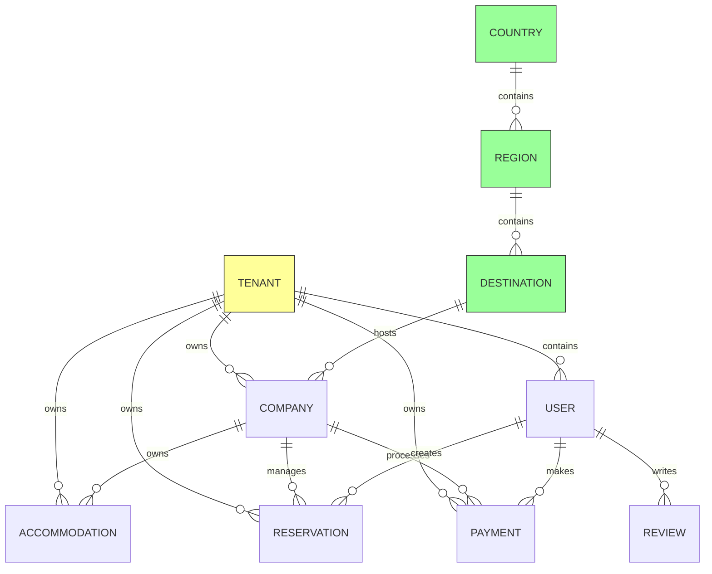

# Valdi Platform Database ERD — Mermaid Diagram

> **Version:** v4.1
> **Phase:** P12.3.1 — Database Connection & Migration
> **Type:** Entity Relationship Diagram (Visual)
> **Date:** 2026-08-06

---

## How to View

Copy the code blocks below into any Mermaid-compatible viewer:
- [Mermaid Live Editor](https://mermaid.live)
- VS Code with Mermaid extension
- GitHub/GitLab Markdown preview
- Notion, Obsidian, etc.

---

## LAYER 1: PLATFORM



---

## LAYER 2: ECOSYSTEM



---

## LAYER 3: COMPANY

```mermaid
erDiagram
    DESTINATION ||--o{ COMPANY : "hosts"
    TENANT ||--o{ COMPANY : "owns"
    COMPANY ||--|| COMPANY_PROFILE : "has"
    COMPANY ||--|| COMPANY_SETTING : "configures"
    COMPANY ||--o{ COMPANY_MODULE : "enables"
    COMPANY ||--o{ USER : "employs"
    COMPANY ||--o{ ACCOMMODATION : "owns"
    COMPANY ||--o{ RESERVATION : "manages"
    COMPANY ||--o{ PAYMENT : "processes"
    COMPANY ||--o{ INVOICE : "issues"
    COMPANY ||--o{ REVIEW : "receives"
    COMPANY ||--o{ NOTIFICATION : "sends"

    MODULE ||--o{ COMPANY_MODULE : "assigned to"

    COMPANY {
        uuid id PK
        uuid tenant_id FK
        uuid destination_id FK
        varchar name
        varchar slug UK
        varchar type
        varchar status
        jsonb contact
        jsonb location
        jsonb branding
        boolean is_active
        timestamp created_at
        timestamp updated_at
    }

    COMPANY_PROFILE {
        uuid id PK
        uuid company_id FK UK
        text bio
        text story
        text mission
        text vision
        jsonb values
        jsonb team
        boolean is_published
        timestamp published_at
        timestamp created_at
        timestamp updated_at
    }

    COMPANY_SETTING {
        uuid id PK
        uuid company_id FK UK
        varchar timezone
        varchar locale
        varchar currency
        varchar date_format
        varchar time_format
        jsonb business_rules
        jsonb booking_rules
        jsonb payment_settings
        jsonb notification_settings
        boolean is_active
        timestamp created_at
        timestamp updated_at
    }

    COMPANY_MODULE {
        uuid id PK
        uuid company_id FK
        varchar module_code
        varchar module_name
        varchar status
        jsonb configuration
        jsonb permissions
        boolean is_enabled
        timestamp enabled_at
        timestamp created_at
        timestamp updated_at
    }
```

---

## LAYER 4: IDENTITY

```mermaid
erDiagram
    TENANT ||--o{ USER : "contains"
    COMPANY ||--o{ USER : "employs"
    USER ||--o{ USER_ROLE : "has"
    USER ||--o{ USER_SESSION : "maintains"
    USER ||--o{ NOTIFICATION_PREFERENCE : "configures"

    ROLE ||--o{ USER_ROLE : "assigned to"
    ROLE }o--|| PERMISSION : "contains"

    USER ||--o{ RESERVATION : "creates"
    USER ||--o{ REVIEW : "writes"
    USER ||--o{ PAYMENT : "makes"

    USER {
        uuid id PK
        uuid tenant_id FK
        uuid company_id FK
        varchar email UK
        varchar username UK
        varchar password_hash
        varchar first_name
        varchar last_name
        varchar display_name
        varchar type
        varchar status
        boolean email_verified
        boolean mfa_enabled
        jsonb profile
        jsonb preferences
        timestamp last_login_at
        timestamp deleted_at
        timestamp created_at
        timestamp updated_at
    }

    ROLE {
        uuid id PK
        uuid tenant_id FK
        uuid company_id FK
        varchar name
        varchar slug
        varchar type
        text description
        jsonb permissions
        boolean is_system
        boolean is_default
        boolean is_active
        timestamp created_at
        timestamp updated_at
    }

    PERMISSION {
        uuid id PK
        varchar name
        varchar slug UK
        varchar resource
        varchar action
        text description
        jsonb attributes
        boolean is_active
        timestamp created_at
        timestamp updated_at
    }

    USER_ROLE {
        uuid id PK
        uuid user_id FK
        uuid role_id FK
        uuid tenant_id FK
        uuid company_id FK
        boolean is_active
        uuid granted_by
        timestamp granted_at
        timestamp expires_at
        timestamp created_at
        timestamp updated_at
    }

    USER_SESSION {
        uuid id PK
        uuid user_id FK
        varchar token_hash UK
        varchar refresh_token_hash
        jsonb device_info
        varchar ip_address
        varchar type
        varchar status
        timestamp expires_at
        timestamp last_activity_at
        timestamp created_at
        timestamp updated_at
    }

    NOTIFICATION_PREFERENCE {
        uuid id PK
        uuid user_id FK UK
        boolean email
        boolean sms
        boolean push
        boolean whatsapp
        boolean in_app
        boolean reservation_confirmations
        boolean reservation_reminders
        boolean reservation_cancellations
        boolean marketing
        varchar frequency
        varchar quiet_hours_start
        varchar quiet_hours_end
        timestamp created_at
        timestamp updated_at
    }
```

---

## LAYER 5: BUSINESS



---

## COMPLETE PLATFORM ERD (Single Diagram)



---

## EXPERIENCE ENGINE DATA FLOW



---

## MULTI-TENANT ISOLATION



---

## VALIDATION STATUS

```
┌─────────────────────────────────────────────────────────────────────────┐
│                         ERD VALIDATION CHECKS                            │
├─────────────────────────────────────────────────────────────────────────┤
│  ✓ PLATFORM_MANIFEST.md ....................... MATCHES                 │
│  ✓ VALDI_PLATFORM_VISION.md .................. MATCHES                 │
│  ✓ MULTI_ECOSYSTEM_ARCHITECTURE.md ........... MATCHES                 │
│  ✓ PLATFORM_FREEZES.md ....................... RESPECTS                │
│  ✓ P13.8 Platform Core Freeze ................ NOT VIOLATED            │
│  ✓ P15.0 Platform Vision Freeze .............. NOT VIOLATED            │
│  ✓ Repository boundary ....................... PRESERVED               │
│  ✓ BusinessService independence .............. PRESERVED               │
│  ✓ Multi-tenancy support ..................... DESIGNED                │
│  ✓ Multi-destination support ................. DESIGNED                │
│  ✓ Experience Engine integration ............. DESIGNED                │
└─────────────────────────────────────────────────────────────────────────┘

┌─────────────────────────────────────────────────────────────────────────┐
│                           VERDICT                                        │
├─────────────────────────────────────────────────────────────────────────┤
│                                                                           │
│    DATABASE ARCHITECTURE:  ████████████████████████████  PASS            │
│                                                                           │
│    ERD DESIGN:            ████████████████████████████  APPROVED          │
│                                                                           │
│    READY FOR:             P12.3.1 Step 2 — Drizzle Schema Implementation │
│                                                                           │
└─────────────────────────────────────────────────────────────────────────┘
```
